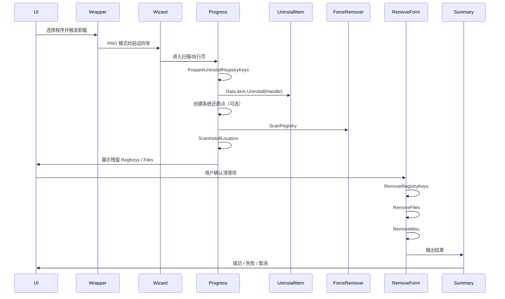

# Your Uninstaller! Delphi 版本深度拆解

本文档是对 `jasoft/Uninstaller` 的第二层补充，重点放在：

1. **旧版完整架构拆解**
2. **旧版卸载主链路时序**
3. **旧资产映射到你当前 `rust_yu` 的建议**
4. **值得保留 / 不建议迁移的判断**

## 1. 旧版产品定位复盘

从 `ursoftware.com` 与仓库内遗留资料看，旧版 Your Uninstaller! 的产品叙事一直是：

- “把程序完全卸干净”
- “连注册表残留、磁盘残留一起扫掉”
- “比 Windows 自带添加删除程序更彻底”
- “支持普通卸载、强制扫描、启动项、磁盘清理等附加工具”

但如果你只看代码，会发现它的核心竞争力其实不是 UI，而是以下 5 层：

### 1.1 五层核心资产

1. **应用模型层**
   - 统一抽象了经典注册表应用、MSI、屏保、失败条目等类型

2. **枚举层**
   - 注册表枚举
   - MSI 枚举
   - 屏保枚举
   - Shell App 尝试

3. **展示层**
   - `AppRender` / `TYURenderedApp`
   - 把底层 item 转换为 UI 可消费的展示模型

4. **卸载执行层**
   - 调用原生 `UninstallString`
   - 向导式流程
   - 系统还原点
   - 结果收集

5. **残留扫描层**
   - 注册表扫描
   - 文件扫描
   - 强制扫描
   - 按 Safe / Normal / Super 控制范围

这 5 层，是你当前 Rust/Tauri 版本最值得继承的部分。

---

## 2. 旧版架构总览

## 2.1 代码组织

### 2.1.1 `src/v7`

这是产品壳和 UI 命令入口，包含：

- 主程序入口 `urUninstaller.dpr`
- 主窗口 `MainFormUnit.pas`
- 卸载列表主窗口 `UninstallerFormUnit.pas`
- 各类模块页：启动项、磁盘清理、开始菜单、IE 菜单、痕迹擦除、工具集
- 向导页 `UninstallWizard/*`
- Hunter / 拖拽卸载入口 `UninstallHunter/*`

### 2.1.2 `src/common`

这是真正的业务引擎，包含：

- `UninstallItem.pas`
- `UninstallManager.pas`
- `EnumApp.pas`
- `AppRender.pas`
- `UninstallerFacade.pas`
- `Scanner.pas`
- `AppForceRemover.pas`
- `StartupManager.pas`
- `InstallLocationAnalyser.pas`
- `SystemRestore.pas`
- `SafeRemover.pas`
- `FindApp.pas`
- `MSIUtils.pas`

### 2.1.3 `lib/urslib`

大量 UI / 通用工具封装，不属于产品核心逻辑，但支撑了旧版界面能力。

---

## 2.2 旧版最值得复读的 12 个文件

1. `src/v7/urUninstaller.dpr`
2. `src/v7/MainFormUnit.pas`
3. `src/v7/UninstallerFormUnit.pas`
4. `src/v7/UninstallWizard/uUninstallWizardContainer.pas`
5. `src/v7/UninstallWizard/WizIntf.pas`
6. `src/v7/UninstallWizard/WizProgressFormUnit.pas`
7. `src/v7/UninstallWizard/uWizRemoveProgressForm.pas`
8. `src/v7/UninstallWizard/WizSummaryFormUnit.pas`
9. `src/common/UninstallItem.pas`
10. `src/common/UninstallManager.pas`
11. `src/common/EnumApp.pas`
12. `src/common/AppRender.pas`

---

## 3. 旧版核心领域模型

## 3.1 `UninstallItem.pas`

这是旧版最重要的对象模型。

### 3.1.1 接口层

旧版定义了：

- `IShellApp2`
- `IInstalledApp2`
- `IQueryInfo`

它的语义是：

| 接口 | 关心什么 |
|---|---|
| `IShellApp2` | 是否安装、是否损坏、AppInfo、SlowAppInfo、PossibleActions |
| `IInstalledApp2` | 在此基础上增加 Uninstall / ForceUninstall / Modify / Repair / Upgrade |
| `IQueryInfo` | 名称、InfoTip |

### 3.1.2 `TUninstallItem`

这是抽象基类，代表一个“可卸载项”。

关键方法：

- `GetDisplayName`
- `GetAppInfo`
- `IsInstalled`
- `IsCorrupted`
- `IsFrom`
- `Uninstall`
- `ForceUninstall`
- `DeleteIdentify`

### 3.1.3 实现类

- `TInstalledApp`
  - 经典注册表应用主实现
- `TVirtualInstalledApp`
  - 虚拟壳
- `TFailedRemoveApp`
  - 卸载失败条目
- `TInstalledScreenSaver`
  - 屏保
- `TWindowsUpdateUninstallItem`
  - Windows 更新
- `TNullUninstallItem`
  - 空实现兜底

### 3.1.4 `APPINFODATA`

旧版自己的应用信息结构，用于统一描述一个程序：

- `DisplayName`
- `Version`
- `Publisher`
- `SupportUrl`
- `HelpLink`
- `InstallLocation`
- `InstallSource`
- `InstallDate`
- `Image`
- `ReadmeUrl`
- `UpdateInfoUrl`
- `Key`
- `ParentDisplayName`
- `ParentKeyName`

### 3.1.5 旧模型对你当前项目的意义

这基本就是你现在 Rust 版 `InstalledProgram` 的原型。

但旧版有一个很老练的设计：  
它把“底层 item”和“展示 item”分开了。

这就是 `UninstallItem -> AppRender -> IYURenderedApp` 的价值。

---

## 3.2 `InstalledApp.pas`（`src/v7/InstalledItems`）

这个文件展示了另一套属性化模型，字段包括：

- `DisplayName`
- `DisplayVersion`
- `Publisher`
- `InstallLocation`
- `UninstallString`
- `ProductCode`
- `HelpLink`
- `URLInfoAbout`
- `URLUpdateInfo`
- `NoModify`
- `NoRemove`
- `IsHidden`
- `IsNew`
- `IsBadItem`
- `LargestFile`
- `RealInstallLocation`

其中 `GetRealInstallLocation` 特别重要：

说明旧版不会盲信注册表里的 `InstallLocation`，而是会尝试推断真实目录。

---

## 4. 应用枚举与管理

## 4.1 `EnumApp.pas`

### 4.1.1 枚举器接口

```delphi
IYUEnumInstalledApps = interface (IInterface)
  function Next(var ia:IInstalledApp2): Boolean;
  function Reset: Boolean;
end;
```

这是典型的迭代器抽象。

### 4.1.2 枚举器分类

1. `TYUEnumInstalledApps`
2. `TShellEnumInstalledApps`
3. `TEnumScreenSavers`

### 4.1.3 Legacy 注册表枚举

`GetNextLegacyApp`：

- 先遍历 `HKLM`
- 再遍历 `HKCU`

对每个子键：

- 读 `DisplayName`
- 读 `UninstallString`
- 排除 `SystemComponent = 1`
- 排除 `WindowsInstaller = 1`

### 4.1.4 MSI 枚举

`GetNextMsiApp`：

- 调用 `MsiEnumProducts`
- 查询 `SystemComponent`
- 查询 `MsiQueryProductState`

---

## 4.2 `UninstallManager.pas`

这是应用管理层。

### 4.2.1 核心职责

- 维护已安装程序列表
- 维护坏条目
- 维护新安装应用
- 维护失败卸载记录
- 提供搜索能力

### 4.2.2 核心方法

- `EnumApps()`
- `Refresh`
- `Find`
- `FindByFileName`
- `GetByName`
- `Remove`
- `ExportItems`

---

## 4.3 `AppRender.pas`

这是展示层转换器。

### 4.3.1 `IYURenderedApp`

提供：

- `DisplayName`
- `DisplayVersion`
- `Publisher`
- `InstallDate`
- `InstallLocation`
- `InstallSource`
- `Size`
- `UninstallString`
- `HelpLink`
- `URLUpdateInfo`
- `LoadExtraInfo`

### 4.3.2 `TYURenderedApp`

职责：

- 包装 `IInstalledApp2`
- 懒加载 extra info
- 缓存 icon index
- 缓存 SlowAppInfo

### 4.3.3 为什么重要

因为这解释了旧版为什么不是把原始注册表对象直接丢给 UI。  
你当前 Rust/Tauri 项目应该继续继承这套分层。

---

## 5. 旧版卸载链路时序

## 5.1 两条卸载路径

旧版天然有两条路径：

### 5.1.1 BASIC 模式

路径：

1. 用户选择程序
2. 确认卸载
3. 调用 `Item.Uninstall(Handle)`
4. 提示成功或失败
5. 从管理器移除条目

封装在 `GUIUninstallerWrapper.pas`。

### 5.1.2 PRO 模式（向导模式）

路径：

1. 进入向导
2. 选择卸载模式
3. 执行卸载
4. 扫描残留
5. 选择清理项
6. 执行清理
7. 查看结果

封装在 `UninstallWizard/*`。

---

## 5.2 向导容器

`uUninstallWizardContainer.pas` 是向导总控。

它注册的页面有：

- `WIZ_PAGE_UNINSTALLTYPE`
- `WIZ_PAGE_SCANPROGRESS`
- `WIZ_PAGE_JUNK`
- `WIZ_PAGE_REMOVEPROGRESS`
- `WIZ_PAGE_SUMMARY`

共享上下文是 `TUninstallData`，包含：

- `Item`
- `RegKeys`
- `Files`
- `Result`
- `ErrorMsg`
- `UninstallMode`
- `AutomatedUninstall`

---

## 5.3 卸载模式选择

`uWizUninstallType.pas` 控制扫描深度：

- `umBuiltIn`
- `umSafe`
- `umNormal`
- `umSuper`

这是后面 `AppForceRemover` 的入口参数。

---

## 5.4 核心执行过程

`WizProgressFormUnit.pas` 是旧版最重要的执行文件之一。

### 5.4.1 三步主流程

1. **Uninstall**
2. **ScanRegistry**
3. **ScanInstallLocation**

### 5.4.2 Uninstall 阶段

这个阶段做的事：

- 加载额外信息
- 记录 `InstallLocation`
- 如果开了系统还原，创建还原点
- 调用原生卸载
- 处理失败/取消异常

### 5.4.3 `PrepareUninstallRegistryKeys`

先把已知卸载相关键收集起来：

- `HKLM\...\Uninstall\<key>`
- `HKCU\...\Uninstall\<key>`
- `ARPCache\<key>`
- `YUCache\<key>`
- MSI 产品额外注册表群

### 5.4.4 `ScanRegistry`

调用 `TForceUninstaler` 做注册表扫描。

### 5.4.5 `ScanInstallLocation`

扫描：

- 安装目录
- Program Files 可能目录
- Desktop
- Start Menu
- AppData

---

## 5.5 残留清理阶段

`uWizRemoveProgressForm.pas` 负责执行清理。

顺序是：

1. `RemoveRegistryKeys`
2. `RemoveFiles`
3. `RemoveMisc`

完成后跳转 `WizSummaryFormUnit.pas` 显示结果。

---

## 5.6 完整卸载时序图



---

## 6. 强制扫描引擎

## 6.1 `AppForceRemover.pas`

这是旧版最核心的“残留搜索器”。

### 6.1.1 扫描范围

按模式逐步扩大：

- `umSafe`
  - Uninstall / ARPCache
- `umNormal`
  - 再覆盖 `HKCU/HKLM Software`
- `umSuper`
  - 再进入 `HKCR`

### 6.1.2 匹配策略

不是直接删，而是先做匹配：

1. 程序名相似度匹配
2. 安装目录里的 exe/dll 列表建立哈希
3. 注册表值包含已知路径
4. 命中后展开父键

### 6.1.3 超时机制

通过 `TTimer` 控制超时，防止死扫。

### 6.1.4 现代意义

你当前 `scanner/registry.rs`、`scanner/filesystem.rs` 的直接原型就在这里。

但旧版缺陷也很明显：

- 没有置信度评分体系
- 规则偏经验化
- 缺少删除前备份/回滚

---

## 7. 启动项、磁盘清理、痕迹擦除

## 7.1 `StartupManager.pas`

旧版启动项覆盖很全：

- Run / RunOnce / RunOnceEx
- RunServices / RunServicesOnce
- NT Run / NT Load
- Policy Run
- 隐藏 Run
- Startup Folder

并提供：

- `Hide`
- `Show`
- `Remove`
- `Save`
- `UpdateStatus`

---

## 7.2 `uDiskCleanerForm.pas`

磁盘清理模块，覆盖：

- 临时目录
- 特定后缀文件扫描
- 删除/批量删除/打开目录/查看详情

---

## 7.3 `InternetTraceEraser.pas`

浏览器痕迹清理模块：

- Cookies
- Temporary Internet Files
- TypedURLs
- History
- Search
- Passwords
- Saved Forms
- Firefox 对应项

---

## 8. 测试、脚手架、辅助模块

## 8.1 `DUnit`

存在测试骨架：

- `RegScannerTest`
- `UtilsTest`
- `StartupManagerFormTest`
- `EnumAppsTest`
- `YUTestCases`

但总体覆盖率低，只能算局部验证。

## 8.2 Hunter / 拖拽模式

`uHuntForm.pas` 提供了拖拽式入口：

- 窗口捕获
- 文件 drop
- 托盘
- 快速卸载
- 右键菜单式操作

## 8.3 配置与新闻

`OptionsFormUnit.pas` / `uNewsManager.pas` 说明旧版有较强的运营化习惯：

- INI 配置
- 自动更新入口
- 新闻弹窗
- 注册码、试用、Nag

这些都不应进入新版。

---

## 9. 旧版缺陷总结

## 9.1 架构缺陷

1. **UI 驱动业务**
   - 业务逻辑长在 Form 里

2. **模块边界模糊**
   - `common` 与 `v7` 耦合太紧

3. **全局状态多**
   - 大量单例、全局变量、DataModule

4. **配置与商业逻辑混杂**
   - Trial / Nag / Armadillo / JLock 混入主链路

5. **过时技术栈**
   - VCL 自绘控件、旧皮肤框架、部分 COM/WMI 写法都不适合现代迁移

---

## 9.2 产品缺陷

1. 工具箱化，主线不聚焦
2. 安全与回滚能力不足
3. 缺少统一的置信度和可验证结果体系
4. UI 现代化成本过高，不适合直接复用

---

## 10. 旧模型到现代 `rust_yu` 的映射建议

## 10.1 最值得迁移的能力

### 10.1.1 应用模型统一

旧源码参考：

- `UninstallItem.pas`
- `InstalledApp.pas`
- `InstalledItem.PAS`

建议新模型：

- `InstalledAppIdentity`
- `InstalledAppMetadata`
- `InstalledAppInstallerContext`
- `InstalledAppRuntimeHints`
- `InstalledProgram`

---

### 10.1.2 应用枚举

旧源码参考：

- `EnumApp.pas`
- `UninstallManager.pas`

建议新模块：

- `InstalledAppRegistry`
- `InstalledAppStore`
- `RegistryProgramEnumerator`
- `MsiProgramEnumerator`
- `StoreProgramEnumerator`

---

### 10.1.3 展示层映射

旧源码参考：

- `AppRender.pas`
- `TYURenderedApp`
- `uAppInfoFrame.pas`

建议新模块：

- `ProgramPresentationMapper`
- `RenderedProgram`
- `ProgramViewModel`

你在前端的 `usePrograms` / `mapBackendToProgram` / `ProgramDetails` 其实已经是同一层，继续正规化即可。

---

### 10.1.4 卸载执行

旧源码参考：

- `GUIUninstallerWrapper.pas`
- `uUninstallWizardContainer.pas`
- `WizProgressFormUnit.pas`
- `uWizRemoveProgressForm.pas`
- `WizSummaryFormUnit.pas`

建议新模型：

- `UninstallJob`
- `UninstallJobRunner`
- `UninstallJobState`
- `UninstallSummary`

建议新状态机：

```text
confirm
  -> precheck
  -> create_restore_point
  -> uninstall
  -> verify_removal
  -> scan_registry_traces
  -> scan_filesystem_traces
  -> review_traces
  -> clean_traces
  -> report
```

---

### 10.1.5 强制扫描

旧源码参考：

- `AppForceRemover.pas`
- `Scanner.pas`
- `FindApp.pas`

建议新模块：

- `TraceScanner`
- `RegistryTraceScanner`
- `FilesystemTraceScanner`
- `ServiceTraceScanner`
- `TaskTraceScanner`
- `TraceMatchingPolicy`
- `TraceConfidenceScorer`

---

### 10.1.6 启动项

旧源码参考：

- `StartupManager.pas`
- `StartupFormUnit.pas`

建议继续沿用你当前 `startup` 模块，再参考旧版补充：

- 隐藏启动项
- 无效启动项
- 开/关状态语义
- 来源分类细化

---

### 10.1.7 安全删除 / 备份

旧源码参考：

- `SafeRemover.pas`
- `SystemRestore.pas`

建议新模块：

- `BackupSession`
- `SnapshotRegistry`
- `SnapshotFileSystem`
- `SnapshotServices`
- `RestoreSession`
- `UndoJob`

---

## 10.2 不建议迁移的内容

| 类别 | 说明 |
|---|---|
| UI Form 层 | 太老、太耦合，现代化成本大于重做 |
| 商业保护 | Armadillo / JLock / Nag / Trial |
| 附加工具壳 | 磁盘清理、痕迹擦除、IE 菜单管理不应作为主线 |
| 旧皮肤框架 | 会拖慢现代化进程 |
| 过时 WMI/COM 用法 | 仅作思路参考 |

---

## 11. 给你当前 `rust_yu` 的优先级建议

## 11.1 第一优先级

1. 统一应用模型
2. 注册表应用枚举
3. MSI 应用枚举
4. Store 应用枚举
5. 卸载执行主链路
6. 卸载后残留扫描
7. 清理主链路
8. 报告输出

## 11.2 第二优先级

1. 安装器类型识别
2. 安装位置推断
3. 启动项增强
4. CLI 自动化增强
5. 置信度评分
6. 导出能力增强

## 11.3 第三优先级

1. 安全删除会话
2. 还原点集成
3. 更完整的系统痕迹扫描
4. 插件化附加工具

---

## 12. 建议的 Rust 新模块表

| 新模块 | 参考旧源码 |
|---|---|
| `InstalledAppRegistry` | `EnumApp` |
| `InstalledAppStore` | `UninstallManager` |
| `ProgramPresentationMapper` | `AppRender` |
| `LegacyUninstallResolver` | `UninstallItem.TInstalledApp.Uninstall` |
| `MsiUninstallResolver` | `EnumApp.GetNextMsiApp`, `MSIUtils` |
| `StoreUninstallResolver` | `YUShellAppsManager` 相关思路 |
| `PostUninstallTraceScanner` | `AppForceRemover`, `Scanner`, `WizProgressFormUnit` |
| `TraceMatchingPolicy` | `FindApp`, `AppForceRemover` |
| `InstallLocationResolver` | `InstallLocationAnalyser` |
| `StartupSourceRegistry` | `StartupManager` |
| `SafeCleanupSession` | `SafeRemover` |
| `SystemRestoreConnector` | `SystemRestore` |
| `UninstallJobRunner` | `WizProgressFormUnit` |
| `UninstallReporter` | `WizSummaryFormUnit` + 现代报告 |

---

## 13. 结论

如果只说一句话：

**旧版 Your Uninstaller! 真正值得继承的，不是它的 UI，而是它那套围绕应用枚举、应用模型、卸载向导、强制扫描和启动项管理构建起来的旧引擎。**

你当前 `rust_yu` 已经比旧版更现代、更有结构。  
接下来最有价值的事，不是模仿旧版界面，而是把旧版这些深层能力提炼成：

- 稳定的 Rust 后端模型
- 明确的 CLI 命令
- 现代 Tauri 前端
- 可证明的卸载结果

这样才是对旧版产品真正的升级。
